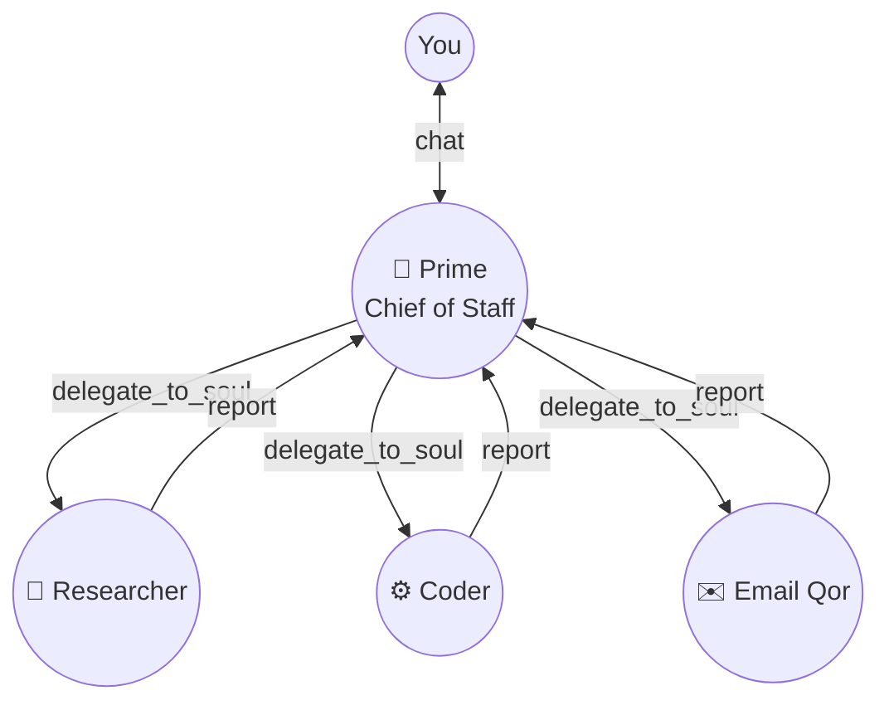

<Info>
  Prime is your **Chief of Staff** Qor. It listens to your message, decides whether it can answer directly, and if not, **delegates** to a specialist Qor. The specialist runs its own agent loop, uses its own tools, and returns a result. Prime composes the final answer.
</Info>

## The delegation triad

<Frame caption="Roles: you, Prime, specialists. Prime doesn't do work; it routes.">

</Frame>

## Three tools make it happen

<CardGroup cols={3}>
  <Card title="delegate_to_soul" icon="send" href="/tools/delegation/delegate-to-soul">
    Fire-and-forget. Kicks off a specialist's loop in the background, Prime keeps chatting. Results stream back as they complete.
  </Card>
  <Card title="manage_agents" icon="user-plus" href="/tools/delegation/manage-agents">
    Spawn a new Qor on the fly. *"Create a specialist called 'Inbox Triage' whose job is…"* — Prime calls this when no existing Qor fits.
  </Card>
  <Card title="room" icon="users" href="/tools/delegation/room">
    Multi-Qor collaboration. Prime opens a room, invites 3 specialists, they iterate. Good for tasks that need back-and-forth between agents.
  </Card>
</CardGroup>

## When Prime delegates vs. answers directly

Prime's system prompt tells it to delegate when any of these are true:

- The task needs a specialised toolset (code IDE, browser, email, calendar)
- The task will take >30 seconds
- The task is parallelisable (research multiple topics, call multiple APIs)
- An existing specialist already handles this domain

Prime answers directly when:

- The request is conversational ("what's your status?", "summarise what we've discussed")
- The answer is in context or memory already
- Delegation would be slower than just answering

You can tune this by editing Prime's system prompt. [Customising Prime →](/qors/system-prompts)

## The lifecycle

<Steps>
  <Step title="User message arrives">
    Web UI / channel webhook → `POST /v1/chat/completions` → Prime's agent loop.
  </Step>
  <Step title="Prime decides to delegate">
    LLM emits a tool call like:
    ```json
    {
      "tool": "delegate_to_soul",
      "args": {
        "agent_name": "Researcher",
        "task": "find flights BOM → SIN next Friday"
      }
    }
    ```
  </Step>
  <Step title="Specialist spawns">
    If `Researcher` exists → loaded. If not → `manage_agents` creates one with a default system prompt + Prime's task.
  </Step>
  <Step title="Specialist runs its own loop">
    Uses its tools (here: `flight_search`, `web_fetch`). Writes to its own memory. Streams progress events to the `delegation_card` widget in the web UI so you can watch.
  </Step>
  <Step title="Report flows back">
    The specialist's final message becomes a tool-result appended to Prime's conversation. Prime resumes with that result in context.
  </Step>
  <Step title="Prime composes the final answer">
    Prime wraps the specialist's output in a conversational response, formats it, sends to you.
  </Step>
</Steps>

## What you see in the UI

<Frame caption="Delegation appears as a live card in Prime's chat. Click to see the full trace.">
  
</Frame>

The card shows:

- Who Prime delegated to
- The task text
- Live status: `delegating → running → done / failed`
- Live tool calls from inside the specialist (expandable)
- Final output

Every delegation is also recorded in the [audit log](/web-ui/audit).

## Async delegation — fire and forget

`delegate_to_soul` is **non-blocking by default**. Prime can dispatch three tasks in parallel and continue chatting with you. Results arrive via WebSocket events as each specialist finishes.

```text
You:     plan my week
Prime:   Delegating to 3 specialists…
         → Calendar Qor (reading this week's events)
         → Priority Qor (scoring tasks by urgency)
         → Brief Qor (drafting the summary)

Prime:   Here's your week. [result from Calendar, Priority, Brief all merged]
```

## When Prime spawns vs. reuses

<AccordionGroup>
  <Accordion title="Existing Qor matches">
    Prime uses `list_souls` first. If there's a Qor whose `role` or `title` matches the task, Prime picks it. No spawning cost.
  </Accordion>

  <Accordion title="No match → spawn with a template">
    `manage_agents(action="create", template="researcher")` creates a Qor from the `researcher` built-in template. 10 built-in templates: researcher, coder, email_triage, writer, analyst, ops, reviewer, scheduler, social, support.
  </Accordion>

  <Accordion title="Custom spawn">
    Prime can specify a completely custom system prompt, toolset, and model. *"Create an agent called 'CFO' whose job is to..."* with full control.
  </Accordion>

  <Accordion title="Ephemeral vs. persistent">
    Spawned specialists default to **persistent** — they live in `agents` and can be re-used. If Prime passes `ephemeral=true` they're deleted after the task completes. Default is persistent so you accumulate a useful specialist roster over time.
  </Accordion>
</AccordionGroup>

## Rooms: when delegation isn't enough

Sometimes a task needs specialists to talk to each other, not just report to Prime independently. That's what [rooms](/workflows/rooms) are for.

Example — *"produce a competitive analysis deck":*

- Researcher investigates each competitor
- Writer drafts the narrative
- Reviewer critiques for accuracy
- Writer revises based on critique
- Reviewer approves
- Prime takes the final deck and presents it

Rooms are created with the `room` tool, then specialists `room_post` messages to each other and `room_decide` when they reach consensus.

## Safeguards

<AccordionGroup>
  <Accordion title="Delegation depth limit">
    By default, specialists cannot delegate deeper than 3 levels (you → Prime → specialist → sub-specialist). Prevents runaway delegation chains. Configure in `config.toml`:
    ```toml
    [limits]
    max_delegation_depth = 3
    ```
  </Accordion>

  <Accordion title="Per-agent concurrency cap">
    A single Qor can't be handling more than 5 tasks simultaneously (default). New delegations queue. Prevents a popular specialist from getting overwhelmed.
  </Accordion>

  <Accordion title="Tool budget per task">
    Each delegation has a token and tool-call budget. When exceeded, the specialist must wrap up — prevents one task burning your entire monthly API budget.
  </Accordion>

  <Accordion title="Dangerous-action approvals">
    If a specialist tries to call a destructive tool (`exec rm -rf`, `send_email`, `delete_file`) and the Qor is in `approval_required` mode, the call pauses and shows you an approval prompt in Prime's chat. [Approvals →](/tools/approvals)
  </Accordion>
</AccordionGroup>

## Where next

<CardGroup cols={2}>
  <Card title="delegate_to_soul tool" icon="send" href="/tools/delegation/delegate-to-soul">
    Full parameter reference and examples.
  </Card>
  <Card title="manage_agents tool" icon="user-plus" href="/tools/delegation/manage-agents">
    Spawn, configure, delete specialists.
  </Card>
  <Card title="Rooms" icon="users" href="/workflows/rooms">
    Multi-Qor collaboration patterns.
  </Card>
  <Card title="Approvals" icon="check-circle" href="/workflows/approvals">
    Gating destructive operations.
  </Card>
</CardGroup>
