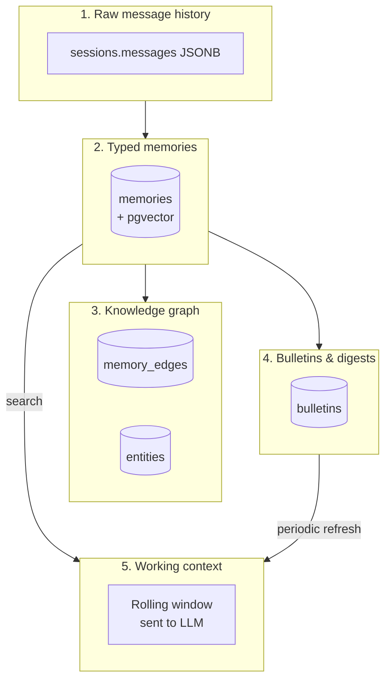

<Info>
  Every Qor has memory. Not just a rolling context window — a **typed, searchable, graph-linked, decay-exempt** memory system that survives compaction, integrates with dreaming for consolidation, and scales to millions of facts on one Postgres instance.
</Info>

## The layers, bottom to top

<Frame caption="Memory is a stack, not a blob. Each layer serves a different use case.">

</Frame>

## Layer 1: raw message history

The simplest layer — every user + Qor message lives in `sessions.messages` as JSONB. This is the audit trail, not the thinking fuel. It grows unbounded.

## Layer 2: typed memories

When something happens that's worth remembering, it becomes a **memory** — a row in `memories` with:

| Field | Purpose |
|---|---|
| `memory_type` | `fact`, `preference`, `decision`, `identity`, `event`, `observation`, `goal`, `todo` |
| `content` | The actual text of what to remember |
| `summary` | One-line version for quick list views |
| `source` | Where it came from (session id, email, voice transcript) |
| `importance` | 0.0–1.0, drives retrieval ranking |
| `embedding` | 1536-dim pgvector, generated at write time |
| `tags` | String array for filtered search |
| `scope` | `agent`, `team`, `task`, `session`, `prime` |
| `decay_exempt` | Whether the memory can be pruned |
| `tsv` | Generated tsvector for BM25 keyword search |

Types matter because different memory types have different retention policies and retrieval triggers:

<AccordionGroup>
  <Accordion title="fact — durable, searchable, never decays">
    *"Priya's laptop is a 2024 M3 MacBook Pro."* Retrieved whenever "Priya" or "laptop" is mentioned.
  </Accordion>

  <Accordion title="preference — shapes tone + behaviour">
    *"Priya prefers bullet points over paragraphs."* Injected into system context every time Priya talks.
  </Accordion>

  <Accordion title="decision — record of what was agreed">
    *"Decided on 2026-04-20: ship v0.4 with Telegram only, WhatsApp in v0.5."* Never decays; always retrievable.
  </Accordion>

  <Accordion title="identity — who the Qor is">
    *"I'm a Researcher Qor specialised in biotech patents."* Seed memory, never decays, included in every system prompt.
  </Accordion>

  <Accordion title="event — something happened">
    *"2026-04-21: user opened a PR to the docs."* Decays over time unless the Qor access-counts it back up.
  </Accordion>

  <Accordion title="observation — weaker than fact, unverified">
    *"User seemed stressed in the last message."* Low-importance unless reinforced.
  </Accordion>

  <Accordion title="goal — ongoing objective">
    *"Launch the marketing site by 2026-05-01."* Retrieved when planning-related messages come in.
  </Accordion>

  <Accordion title="todo — actionable item">
    *"Ping Ramesh about the Q3 numbers."* Lives in todo until marked done.
  </Accordion>
</AccordionGroup>

## Layer 3: knowledge graph

Memories can link to each other and to **entities** (people, projects, companies). Building the graph happens in two ways:

- **Explicit** — the Qor calls `memory.save` with a `links` array
- **Automatic** — the dreamer (layer 5 below) extracts entities from recent memories and creates edges

Graph queries answer questions like *"what do we know about Project Apollo?"* by walking edges from the Apollo entity out to connected memories.

## Layer 4: bulletins & digests

A **bulletin** is a Qor-generated summary of everything it knows right now. Think of it as a cached "identity doc":

- *"I'm Prime at Acme. Priya is the CEO. Current priorities: Q3 launch, hiring. Recent decisions: pricing model, channel selection."*

Bulletins are regenerated on a schedule (default: daily, on-demand available). They're injected into the system prompt so the Qor doesn't have to search memory on every turn.

## Layer 5: working context

What actually goes to the LLM on each turn:

1. System prompt (identity + instructions + latest bulletin)
2. Recent raw messages (the rolling window, bounded by model context)
3. Retrieved memories relevant to the current message (top-K from layer 2)
4. Tool results from the current turn

When the rolling window fills → **compaction**. The oldest half of the window gets summarised, saved as a memory, then evicted. [Compaction →](/memory/compaction)

## Embedding + search

Every memory gets an embedding at write time using the configured embedding provider (OpenAI `text-embedding-3-small` by default; local models via Ollama work too).

Retrieval is **hybrid**: pgvector cosine similarity + BM25 full-text search, combined via Reciprocal Rank Fusion (RRF). In practice this beats either alone for most queries.

```sql
-- Simplified version of the retrieval query
WITH vector_hits AS (
  SELECT id, 1 - (embedding <=> $query_embedding) AS score
  FROM memories WHERE agent_id = $agent_id
  ORDER BY embedding <=> $query_embedding LIMIT 50
),
bm25_hits AS (
  SELECT id, ts_rank(tsv, plainto_tsquery($query)) AS score
  FROM memories WHERE agent_id = $agent_id AND tsv @@ plainto_tsquery($query)
  LIMIT 50
)
-- RRF merge
SELECT id, SUM(1.0 / (60 + rank)) AS rrf_score FROM (...) GROUP BY id ORDER BY rrf_score DESC;
```

[Memory search from the UI →](/memory/search)

## Dreaming (layer 5's maintenance job)

Every N hours (default 6), a background goroutine wakes up per Qor and:

<Steps>
  <Step title="Scans recent raw messages">
    Last 24 hours of session activity.
  </Step>
  <Step title="Extracts candidate facts">
    Uses a cheap LLM call to pull out *"things worth remembering"* — decisions, preferences, new entities, events.
  </Step>
  <Step title="Deduplicates against existing memories">
    Vector similarity + content hash to avoid storing the same fact twice.
  </Step>
  <Step title="Writes new memories + graph edges">
    New facts become rows in `memories`; mentioned entities get linked.
  </Step>
  <Step title="Decays old low-importance memories">
    Observations older than 30 days with access_count=0 get their importance halved. Eventually fall below the retrieval threshold.
  </Step>
  <Step title="Regenerates the bulletin">
    Fresh identity summary for the next turn.
  </Step>
</Steps>

Dreaming runs off-peak, is idempotent, and can be triggered manually via `qorven memory dream <agent>`. [Dreaming deep-dive →](/memory/dreaming)

## Scope — who can see what

Memories have a `scope` that controls who can retrieve them:

| Scope | Meaning |
|---|---|
| `agent` | Private to this Qor (default for most memories) |
| `team` | Shared across a team's Qors |
| `task` | Scoped to a specific task run |
| `session` | Scoped to one session (rare) |
| `prime` | Visible to Prime across all Qors you own |

The `prime` scope is what makes your chief-of-staff Qor *aware* of what your other Qors are doing — without giving it read access to private notes.

## Privacy

<Warning>
  Memories can contain personal data. Qorven has three opt-in controls to manage what gets stored:
</Warning>

- **PII redaction**  — strips emails, phone numbers, credit cards, SSNs before embedding. Settings → Privacy toggles this. [PII redaction →](/security/pii-redaction)
- **Soft-delete** — `memory.delete` marks a memory `deleted=true` but doesn't purge. Recoverable for 30 days then garbage-collected.
- **Right-to-forget** — `memory.purge(user_id)` removes every memory where `source` references that user. Compliance flow for data-subject requests.

## Where next

<CardGroup cols={2}>
  <Card title="Memory types" icon="list" href="/memory/types">
    The eight memory types, when to use each, examples.
  </Card>
  <Card title="Compaction" icon="compress" href="/memory/compaction">
    How the rolling window stays fresh.
  </Card>
  <Card title="Memory search" icon="search" href="/memory/search">
    The UI, the API, hybrid retrieval details.
  </Card>
  <Card title="Dreaming" icon="moon" href="/memory/dreaming">
    Background consolidation in depth.
  </Card>
</CardGroup>
