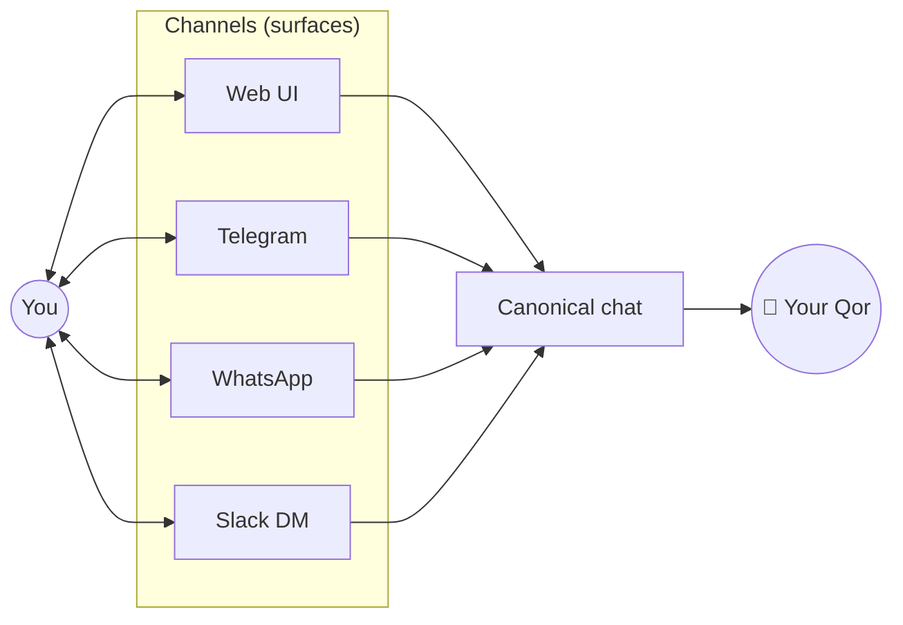

<Info>
  In Qorven, a **Qor is a person**. You don't have N separate conversations with it — you have one. That conversation is reachable from the web UI, the TUI, Telegram, WhatsApp, Slack DMs, Discord DMs. Messages from every channel land in the same thread; each message keeps a channel tag so the right surface renders the right slice.
</Info>

## Why this matters

Most multi-agent platforms let you create a new chat every time you message an agent. By week two you have 47 "New Chat (3)" threads and no idea which one you told it your laptop password was broken.

Qorven collapses that to **one canonical chat per Qor per user**:

- Web UI and TUI show the full timeline, badge-tagged by channel
- Telegram shows only the messages tagged `telegram`
- WhatsApp shows only the messages tagged `whatsapp`
- The Qor's memory is shared across all of them

## The mental model

<Frame caption="A Qor is one 'person'; channels are the phones they can pick up.">

</Frame>

## What counts as "one chat"

| Surface | Merges into the canonical chat? |
|---|---|
| Web UI | ✅ |
| TUI | ✅ |
| Telegram DM | ✅ |
| WhatsApp DM | ✅ |
| Slack DM | ✅ |
| Discord DM | ✅ |
| webchat (embed) | ✅ |
| **Email** | ❌ — different medium (subject lines, threading, attachments) |
| **SMS** | ❌ — different medium |
| **Group chats** (Slack channels, Telegram groups, Discord servers) | ❌ — group-scoped, multi-party |
| **Voice calls** | ❌ — different medium, transcripts flow into memory |
| **Cron runs** | ❌ — background, no user conversation |

## How it's stored

One canonical `sessions` row per (tenant, agent) in Postgres. Its `messages` JSONB column holds the merged timeline, chronologically sorted. Each message carries:

```json
{
  "role": "user",
  "content": "What's next on my calendar?",
  "timestamp": 1776787200000,
  "channel": "telegram",
  "sender_name": "Priya"
}
```

On the wire:

- Web UI fetches the whole session, renders every message with a channel badge for non-`web` messages
- Telegram's "get history" command filters `channel = "telegram"` before sending back
- Per-surface filters use an index on `(session_id, channel, created_at)`

[Full memory system →](/architecture/memory-system)

## What happens on each inbound

<Steps>
  <Step title="Channel webhook hits /v1/webhooks/{channel}">
    Telegram / WhatsApp / Slack send the message to Qorven's HTTP endpoint for that channel.
  </Step>
  <Step title="Dispatcher resolves the Qor">
    `gateway.go` finds which Qor owns this channel binding. If the channel is chat-family (web, tui, telegram, whatsapp, slack_dm, discord_dm, webchat), it looks up the canonical session. Groups / email get their own row.
  </Step>
  <Step title="Message appended with channel tag">
    `sessions.AppendMessage(sessionID, {role, content, channel: "telegram", sender_name})`. The `channel` field is the key piece — it survives compaction, survives re-render, survives everything.
  </Step>
  <Step title="rtHub broadcasts to connected surfaces">
    Web UI and TUI subscribers get a `new_message` event. They decide whether to render (web shows everything, other channels filter).
  </Step>
  <Step title="Agent loop runs">
    Prime (or this Qor) gets called, uses the full merged context to answer, sends the reply. The reply includes `channel = "<whichever channel you sent from>"` so it goes back to the same surface.
  </Step>
</Steps>

## Long conversations don't degrade

<Warning>
  One canonical chat across all channels sounds great until you realise: by month six, the messages column could be 50 MB and the LLM context would blow up every request.
</Warning>

Qorven handles this with three layers:

<Steps>
  <Step title="Sliding window for LLM calls">
    Only the last N tokens (N depends on the model) of messages get sent to the LLM each turn. The rest stays in the DB.
  </Step>
  <Step title="Automatic compaction">
    When the rolling window fills, the auto-compact hook summarises older turns into a short system note and evicts the raw messages from the window. The raw rows stay in the DB for audit. [Compaction →](/memory/compaction)
  </Step>
  <Step title="Memory emission">
    The compaction result is also written to the `memories` table as a `conversation_digest` fact, tagged by date range + channel. Future turns can retrieve it via the [`memory_search` tool](/tools/built-in/memory) when relevant.
  </Step>
</Steps>

Net effect: the canonical chat stays small in the *active context*, unbounded in *total history*, and searchable forever via memory.

## Migration path

If you're upgrading from a pre-"one-chat" Qorven install that has many sessions per Qor, run:

```bash
sudo qorven collapse-sessions --dry-run   # preview
sudo qorven collapse-sessions              # apply
```

This merges extra chat-family sessions into the canonical one, dedupes on `(role, timestamp, content)`, preserves each message's `channel` tag, and emits one memory digest per archived session so nothing's lost. [Command reference →](/cli/collapse-sessions)

## What's different from everyone else

| Platform | Their model | Ours |
|---|---|---|
| ChatGPT | One new conversation per topic | One continuous thread, forever |
| LangChain | No canonical state — you wire it | Built-in |
| AutoGen | N agents × M conversations | Agents are rows; conversations are canonical |
| Letta / MemGPT | One thread per agent | Same |
| Slack bots | Per-channel, no cross-surface memory | One brain, many surfaces |

## Edge cases worth knowing

<AccordionGroup>
  <Accordion title="What if I message the same Qor from two channels at once?">
    Strict chronological interleave. Both messages land in the canonical row with their timestamps; the Qor sees them in real time order. Race conditions are handled by Postgres's `SELECT … FOR UPDATE`.
  </Accordion>

  <Accordion title="What if two users message the same Qor?">
    Multi-user Qors have one canonical chat **per (user, agent)** — each user sees their own thread. Group chats are explicitly different. [Tenant isolation →](/security/tenant-isolation)
  </Accordion>

  <Accordion title="What if I want the old multi-session model?">
    Set `QORVEN_LEGACY_SESSIONS=1` in your config. Backwards-compat mode; not recommended. Future minor versions may remove the flag.
  </Accordion>

  <Accordion title="What about forking a conversation?">
    We don't support forks. The model is "one thread, one memory." If you want to restart with fresh context: ask the Qor to start a new topic; compaction handles it. If you want a genuinely different Qor, create one.
  </Accordion>
</AccordionGroup>

## Where next

<CardGroup cols={2}>
  <Card title="Channels" icon="message-square" href="/channels/index">
    Every supported surface, setup per-channel.
  </Card>
  <Card title="Unified chat (UI)" icon="layout" href="/channels/unified-chat">
    How the web UI renders per-channel badges.
  </Card>
  <Card title="Memory & compaction" icon="database" href="/memory/compaction">
    How long conversations stay performant.
  </Card>
  <Card title="collapse-sessions CLI" icon="terminal" href="/cli/collapse-sessions">
    Migrating an older multi-session install.
  </Card>
</CardGroup>
