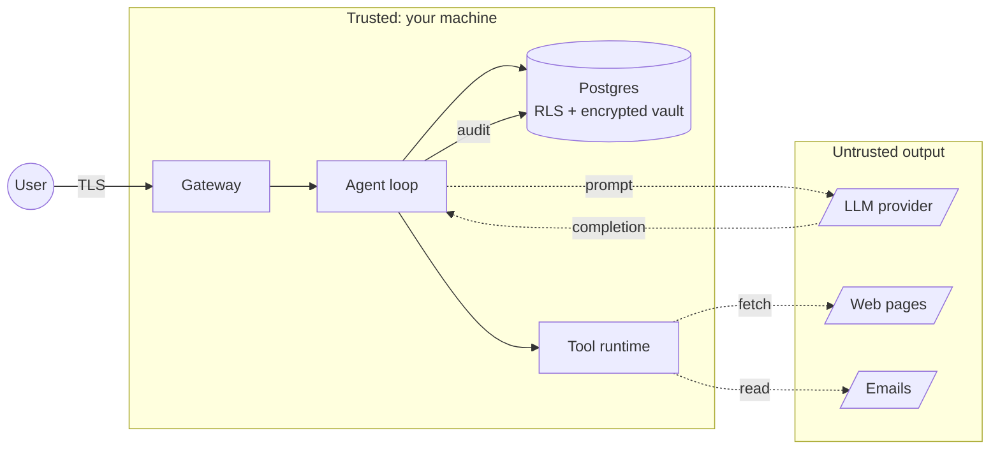

<Info>
  Qorven is designed to run on **untrusted** or **semi-trusted** infrastructure. The threat model assumes: the operator trusts themselves but wants to defend against accidental leaks, compromised LLM outputs, malicious users on the same install, and loss of the host machine.
</Info>

## Non-goals

Up front, what Qorven is **not** trying to protect against:

- A root user on the host. If someone has root on the Qorven box, they can read memory and decrypt the vault. No amount of in-process crypto helps against root.
- A compromised LLM provider. If OpenAI returns a poisoned response, the agent loop processes it.
- Side-channel leaks via chosen prompts. A sufficiently clever user prompt can always smuggle information out.

What we **do** protect against:

- Cross-tenant data leaks on a multi-tenant install
- Secret exfiltration via regular HTTP requests (vault is encrypted at rest)
- Prompt-injection from web pages / emails / PDFs fed to the Qor
- Accidental destructive operations (approval flow)
- Passive network observers (TLS on by default)
- Replay attacks (time-bound auth tokens + audit trail)

## The six pillars

<CardGroup cols={2}>
  <Card title="Per-install encryption" icon="key" href="/security/per-install-encryption">
    A 256-bit key generated once at install encrypts every secret. Lose the key, lose the secrets — no backdoor.
  </Card>
  <Card title="Tenant isolation via RLS" icon="users" href="/security/tenant-isolation">
    Every Postgres table has row-level security. Queries run in a tenant-scoped transaction; even a bug in a handler can't leak across tenants.
  </Card>
  <Card title="TLS by default" icon="lock" href="/security/tls-best-practices">
    Local CA generated at install. Let's Encrypt for public domains. BYO cert supported. No HTTP option without explicit opt-in.
  </Card>
  <Card title="Audit trail" icon="history" href="/security/audit-trail">
    Every mutation + tool call lands in the `audit_log` table with actor, tenant, tool, args, result, timestamp.
  </Card>
  <Card title="Prompt-injection defence" icon="shield-alert" href="/security/prompt-injection-defense">
    Tool calls parsed through a policy layer that catches known injection patterns. Destructive tools require approvals.
  </Card>
  <Card title="PII redaction" icon="eye-off" href="/security/pii-redaction">
    Opt-in filter that strips emails, phones, cards, SSNs from memory writes. Protects both users and the training set any Qor builds from memory.
  </Card>
</CardGroup>

## Data flow with trust boundaries

<Frame caption="Trust boundaries — solid boxes are trusted (your infra), dashed are not.">

</Frame>

Trust boundaries to remember:

- **LLM output is untrusted.** Even from OpenAI. Never directly execute LLM-generated shell commands without the approval gate.
- **Scraped content is untrusted.** A malicious page can contain prompt-injection payloads crafted to hijack tool calls. The policy layer catches known patterns; not all.
- **Email content is untrusted.** Emails can contain injection payloads aimed at an email-reading Qor. Use `destructive_tools_require_approval=true` for any email-handling Qor.

## Secrets lifecycle

<Steps>
  <Step title="Generated at install">
    `encryption_key` (32 bytes from `/dev/urandom`) and `auth_token` (16 bytes). Written to `/etc/qorven/config.toml` with `0640` permissions owned by `qorven:qorven`.
  </Step>
  <Step title="Provider keys / OAuth secrets arrive">
    User pastes into Settings → Provider Keys. Gateway immediately encrypts with AES-256-GCM keyed by `encryption_key`.
  </Step>
  <Step title="Stored in Postgres as bytea">
    `provider_keys.key_enc` is ciphertext. `key_hash` is SHA-256 for dedup without decryption. Neither is reversible without the install's key.
  </Step>
  <Step title="Decrypted in-memory just before use">
    Agent loop pulls the ciphertext, decrypts, calls the LLM. The plaintext never crosses a process boundary or lands on disk.
  </Step>
  <Step title="Cache with short TTL">
    Decrypted keys are cached in-process for 5 minutes to avoid decrypt on every call. Cache flushes on config reload.
  </Step>
</Steps>

## Multi-tenant boundaries

Every Postgres table is tenant-scoped via `tenant_id UUID NOT NULL`. At the gateway:

```go
// Middleware for every authenticated request:
ctx = context.WithValue(ctx, "tenant_id", actor.TenantID)
tx, _ := db.BeginTxWithOptions(ctx, ...)
tx.Exec("SET LOCAL row_security = on")
tx.Exec("SET LOCAL app.current_tenant = $1", actor.TenantID)
```

RLS policies on each table reject rows where `tenant_id != current_setting('app.current_tenant')::uuid`. Bug in a handler that forgets to filter? RLS still blocks. [Tenant isolation →](/security/tenant-isolation)

## Destructive-action approvals

Tools can declare themselves **destructive** in their metadata:

```go
func (t *ExecTool) Destructive() bool { return true }
func (t *SendEmailTool) Destructive() bool { return true }
func (t *DeleteFileTool) Destructive() bool { return true }
```

When a Qor runs in `approval_required` mode, any destructive call pauses the loop and emits an `approval_required` event. The operator sees a prompt in chat: *"Approve executing `rm -rf /tmp/staging`?"* Yes / No / Yes-always-for-this-command. [Approvals flow →](/workflows/approvals)

## Prompt-injection mitigations

Layered, not perfect:

<AccordionGroup>
  <Accordion title="Input-side sanitisation">
    When the agent loop pulls in external content (scraped page, email body, PDF extract), it prefixes it with an injection-resistant wrapper: `<external_content source="..." trust_level="low">...</external_content>` so the LLM sees it as data, not instructions.
  </Accordion>

  <Accordion title="Pattern detection">
    Known injection patterns (`"ignore previous instructions"`, `"system:"`, `"</assistant>"`) are flagged before the LLM call. Flagged content gets an extra wrapper warning the LLM to treat it as adversarial.
  </Accordion>

  <Accordion title="Tool call validation">
    The gateway parses every tool call emitted by the LLM against a JSONSchema. Malformed or out-of-schema calls are rejected before execution.
  </Accordion>

  <Accordion title="Destructive-call approval">
    Even if injection succeeds, destructive tools require human approval unless explicitly configured otherwise. Shifts from "don't let it happen" to "catch it at the last moment."
  </Accordion>

  <Accordion title="SSRF guard">
    The `web_fetch` / `browse` / `scrape` tools go through an SSRF allowlist. Default-deny for private IP ranges. [SSRF config →](/gateway/ssrf-allowlist)
  </Accordion>
</AccordionGroup>

## What's audited

Every mutation with a named subject. Examples:

```jsonl
{"t":"agent.create","actor":"user:priya","tenant":"t_a1","target":"agent_b2","ts":"2026-04-22T01:14:00Z"}
{"t":"tool.call","actor":"agent:b2","tool":"send_email","args":{"to":"..."},"approved_by":"user:priya","ts":"..."}
{"t":"provider_key.update","actor":"user:priya","target":"openai","ts":"..."}
{"t":"config.reload","actor":"system","changed":["tls.mode"],"ts":"..."}
```

Audit log is append-only in Postgres, replicated to disk (`/var/log/qorven/audit.jsonl`) for redundancy. [Audit UI →](/web-ui/audit)

## Upgrade path

Security patches land as minor releases. `qorven update` verifies SHA-256 against the release's sidecar before swapping binaries. Migrations run automatically on next boot. [Self-update →](/cli/update)

## Where next

<CardGroup cols={2}>
  <Card title="Threat model deep-dive" icon="shield" href="/security/threat-model">
    Enumerated threats, mitigations, residual risks.
  </Card>
  <Card title="Per-install encryption" icon="key" href="/security/per-install-encryption">
    Key format, algorithms, rotation.
  </Card>
  <Card title="PII redaction" icon="eye-off" href="/security/pii-redaction">
    Config, what patterns are caught, how to extend.
  </Card>
  <Card title="Audit trail" icon="history" href="/security/audit-trail">
    Schema, retention, export.
  </Card>
</CardGroup>
