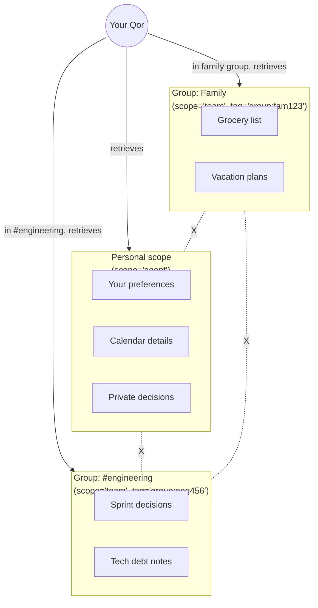

<Info>
  Group chats are **not** merged into the Qor's canonical chat. Each group gets its own session and its own memory scope — so what's said in a group stays in that group.
</Info>

## Why they're different

| DM (1:1) | Group (multi-party) |
|---|---|
| One user, one Qor | Many users, maybe many Qors |
| Context carries across channels | Context is bound to the group |
| Memory is personal | Memory is group-scoped |
| Prime delegates freely | Prime needs explicit @mention to act |
| History merges with web/TUI | History stays in the group |

## The rules

<Steps>
  <Step title="One session per group">
    A Telegram group "Family" gets its own `sessions` row with `channel=telegram_group:<id>`. A Slack channel `#engineering` gets its own. The Qor doesn't mix.
  </Step>
  <Step title="Group-scoped memory">
    Memories extracted from group conversations are stored with `scope=team` and tagged with the group's identifier. They're retrievable when the Qor is operating **inside that group**, not in 1:1 chats.
  </Step>
  <Step title="No cross-contamination">
    Private details from the CEO's 1:1 chat never leak into a group the Qor is also in. Enforced by the memory scope filter at retrieval time.
  </Step>
  <Step title="Mention-required by default">
    In a group, the Qor doesn't answer every message — only messages that mention it (`@Qor` on most platforms, configurable per channel).
  </Step>
</Steps>

## Memory scope diagram

<Frame>

</Frame>

The Qor only ever retrieves memories from scopes it's allowed to see for the current conversation context.

## Configuring group behaviour

In the channel binding, you can tune:

```bash
qorven channels configure telegram-bot \
  --group-mode mention-only \
  --group-reply-as thread \
  --group-memory-scope team
```

**Options:**

| Flag | Values | Default |
|---|---|---|
| `--group-mode` | `mention-only`, `all`, `off` | `mention-only` |
| `--group-reply-as` | `thread`, `inline` | `thread` |
| `--group-memory-scope` | `team`, `agent`, `none` | `team` |

## Routing overrides

You can route different groups to different Qors:

```yaml
# /etc/qorven/routing.yml
groups:
  - match:
      channel: telegram
      group_id: fam123
    qor: home-qor

  - match:
      channel: slack
      channel_id: eng456
    qor: engineering-bot
    restrictions:
      tools:
        - memory
        - send_message
        - github
```

## What leaks, what doesn't

<AccordionGroup>
  <Accordion title="✅ Qor's identity + tone">
    The Qor's system prompt (who it is, how it talks) is shared across all contexts. Your Engineering Qor is always the Engineering Qor.
  </Accordion>

  <Accordion title="❌ Personal facts">
    *"My laptop password is X"* stored in your 1:1 never gets retrieved in a group context. Ever.
  </Accordion>

  <Accordion title="✅ Public-scope knowledge">
    Things marked explicitly `scope=company` or `scope=public` cross freely. Used for shared company policies, public documentation.
  </Accordion>

  <Accordion title="❌ Decisions made in one group">
    If decisions get made in `#engineering`, they're not retrievable in `#marketing` unless you mark them public.
  </Accordion>

  <Accordion title="❌ The Qor's private scratchpad">
    `scope=agent` memories (the Qor thinking to itself) never surface in groups — those are for the Qor's own reasoning.
  </Accordion>
</AccordionGroup>


## Where next

<CardGroup cols={2}>
  <Card title="Channel routing" icon="git-branch" href="/channels/routing">
    Full routing rules reference.
  </Card>
  <Card title="Memory scopes" icon="database" href="/memory/privacy">
    Deep-dive on how scopes work.
  </Card>
  <Card title="Rooms" icon="users" href="/workflows/rooms">
    When you want *multiple Qors* in a conversation, not just multiple humans.
  </Card>
  <Card title="Unified chat" icon="infinity" href="/channels/unified-chat">
    The 1:1 side of the story.
  </Card>
</CardGroup>
