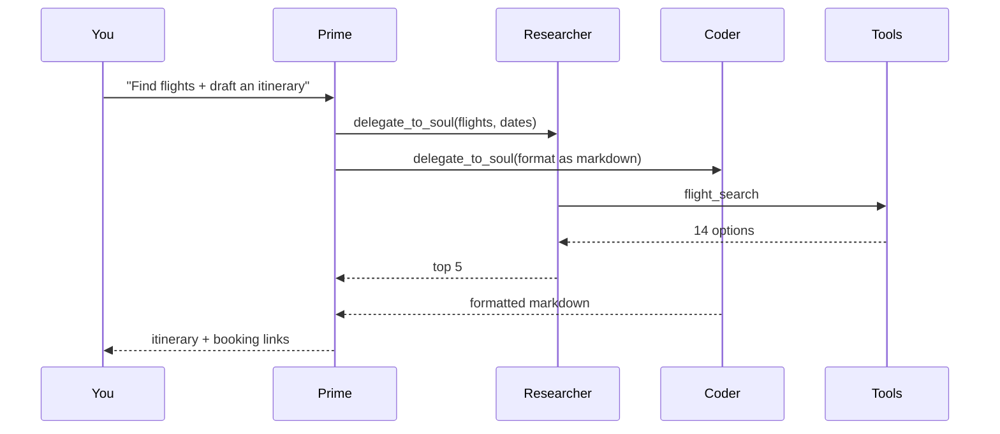

<Info>
  After [installing Qorven](/getting-started/install), this guide takes you from opening the URL to having your first real conversation. 5 minutes. No Postgres, no YAML, no CLI.
</Info>

## 1. Open the UI

The installer prints a URL like `https://192.168.1.42:443` or `https://localhost`. Open it.

<Warning>
  First load shows a **browser warning** because Qorven's local CA isn't trusted on your laptop yet. Either:

  1. Click through the warning once (the cert is real, your machine just doesn't know the CA)
  2. Or run `sudo qorven tls install-ca` once — the warning never appears again. [Full TLS guide →](/security/tls-best-practices)
</Warning>

## 2. Sign in

If this is a fresh install you'll see the setup wizard. Otherwise: paste the auth token the installer printed.

<Frame caption="The login screen. Auth token was printed at the end of the install script.">
  
</Frame>

## 3. Meet Prime

Prime is your **Chief of Staff** Qor — the agent that takes your requests and delegates them to the right specialist. Every Qorven install has a Prime; you don't create it.

<Frame caption="The default chat with Prime. Sidebar left, chat right, memory search top-right of the composer.">
  
</Frame>

Ask anything:

- *"What's the status of my projects?"*
- *"Draft an email to the team about Thursday's offsite"*
- *"Look up flights from Bangalore to Singapore next Friday"*
- *"Read this PDF and summarise the findings"*

## 4. Watch the delegation

Prime rarely does the work itself. It delegates:

<Frame caption="Prime delegating a research task to a specialist. Each delegation shows as a card with live status.">
  
</Frame>

<Steps>
  <Step title="You ask Prime a question">
    Text, voice, screen share — all work. Prime reads your message with your preferences and any relevant [memory](/memory/overview) already loaded.
  </Step>
  <Step title="Prime picks a specialist or spawns one">
    If there's already a Researcher, Coder, or Email Qor, Prime sends them a task. If not, Prime calls [`manage_agents`](/tools/delegation/manage-agents) and creates one on the fly.
  </Step>
  <Step title="Specialists work in parallel">
    Each specialist is its own Qor with its own tools, memory, and workspace. They can talk to each other in [rooms](/workflows/rooms) when the task needs coordination.
  </Step>
  <Step title="Prime reports back">
    You see the final answer. The specialist's full trace — every tool call, every draft — is in the [audit log](/web-ui/audit) if you need to inspect it.
  </Step>
</Steps>

## 5. Try a few signature features

<CardGroup cols={2}>
  <Card title="Send from another channel" icon="message-square" href="/channels/telegram">
    Connect Telegram. Message your Qor from your phone. The same conversation appears in the web UI — [one Qor, one chat](/architecture/one-qor-one-chat).
  </Card>

  <Card title="Search memory mid-chat" icon="search" href="/memory/search">
    Click the 🧠 button above the composer. Search anything you've told this Qor. Click a result to drop it into the composer as context.
  </Card>

  <Card title="Share your screen" icon="monitor" href="/tools/media/screen-share">
    Toolbar → **Share screen**. Your Qor sees what you see (1 frame/sec, never persisted, 30-second TTL).
  </Card>

  <Card title="Open the live browser" icon="globe" href="/tools/browser/live-stream">
    Toolbar → **Live browser**. Watch your Qor browse the web in real time. Great for demoing what it's doing.
  </Card>
</CardGroup>

## What's actually happening under the hood

<Frame caption="Request flow: you → Prime → specialists → tools/channels → results back to you.">

</Frame>

## Where next

<CardGroup cols={2}>
  <Card title="Customise Prime" icon="brain" href="/qors/system-prompts">
    Edit the system prompt, swap the model, change the tools Prime can use.
  </Card>
  <Card title="Create your own Qor" icon="plus" href="/qors/creating-a-qor">
    A Qor per role — Researcher, Email Triage, Standup Bot, Reporter.
  </Card>
  <Card title="Next-steps menu" icon="list" href="/getting-started/next-steps">
    10 things to try in your first hour.
  </Card>
  <Card title="Add your LLM keys" icon="key" href="/models/provider-keys">
    Bedrock, OpenAI, Anthropic, DeepSeek, Gemini, Groq, Ollama.
  </Card>
</CardGroup>
