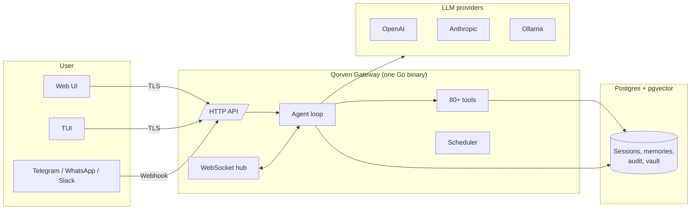
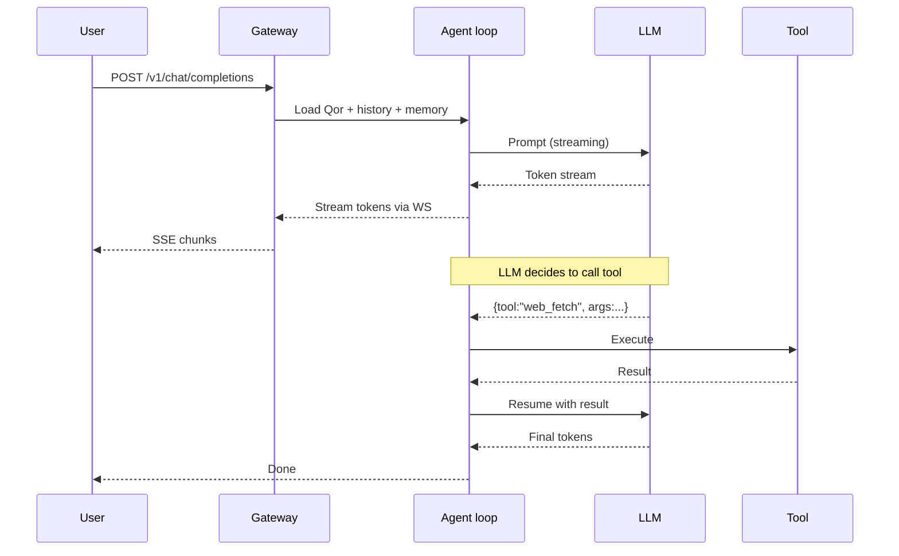
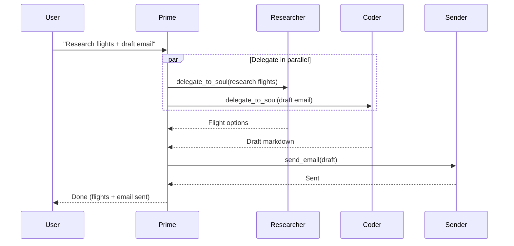
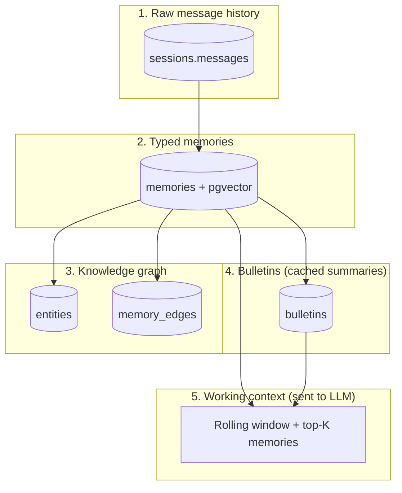
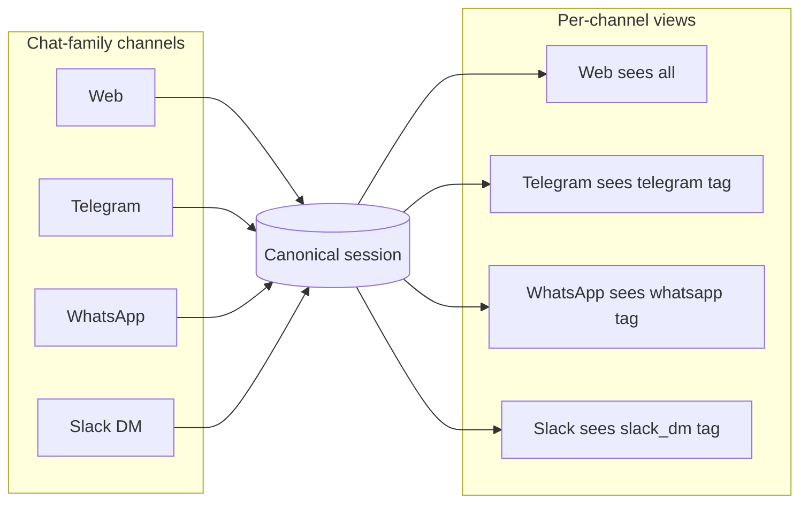
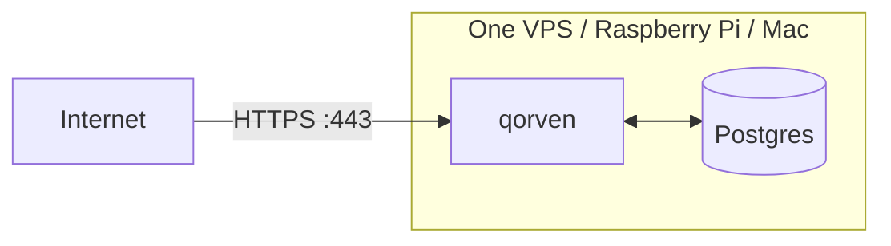
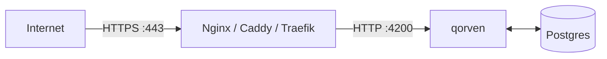
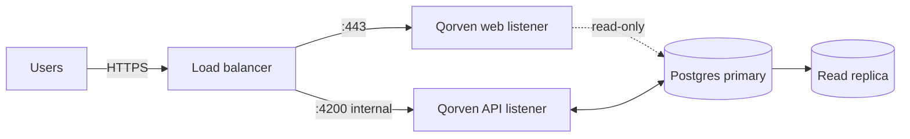

<Info>
  Copy-paste-friendly diagrams for slide decks, onboarding, and design reviews. All Mermaid; render anywhere.
</Info>

## High-level shape

## Request path (simple case)

## Delegation

## Memory stack

## One-Qor-one-chat

## Deployment shapes

### Single-node (default)

### Behind a reverse proxy

### Split API + UI (production)

## Where next

<CardGroup cols={2}>
  <Card title="Architecture overview" icon="layers" href="/architecture/overview">
    Narrative version of the diagrams.
  </Card>
  <Card title="Security model" icon="shield" href="/architecture/security-model">
    Trust boundaries deep-dive.
  </Card>
  <Card title="HTTP API" icon="server" href="/reference/http-api">
    The endpoints behind the request-path diagram.
  </Card>
</CardGroup>
